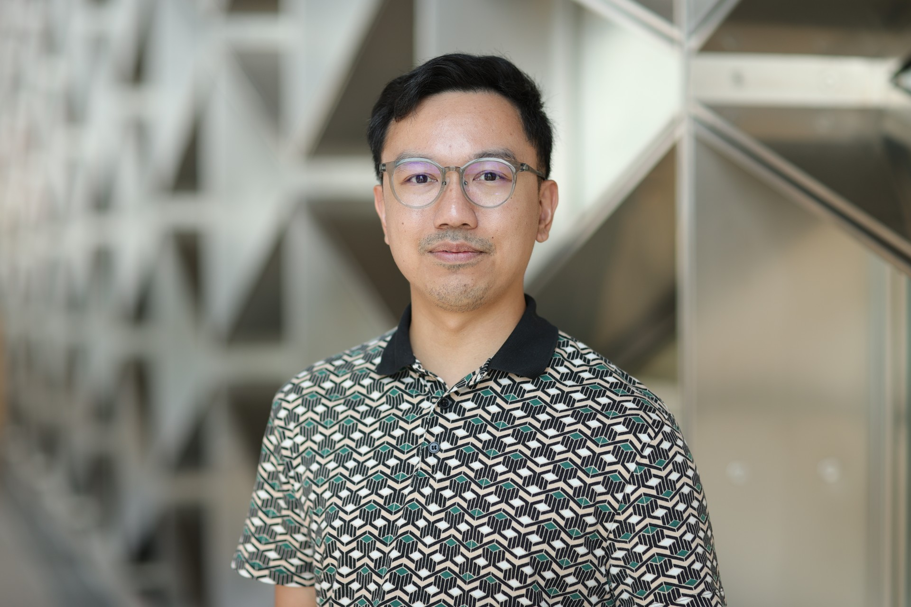

::: {.keynote-card}
::: {.keynote-copy}
## Marta Blangiardo

::: {.keynote-role}
Professor of Biostatistics, Department of Epidemiology and Biostatistics, Imperial College London
:::

::: {.keynote-bio}
Marta Blangiardo's research focuses on the development of statistical models for environmental epidemiology, with particular emphasis on Bayesian hierarchical models and inference using INLA. She has worked on disease mapping methods that account for spatial and spatio-temporal dependence, models combining interrupted time-series approaches with spatial correlation, and climate-health models investigating the effects of temperature on mortality and morbidity.

More recently, she has been developing a statistical framework for wastewater-based epidemiology to predict viral load at high spatio-temporal resolution and assess its relationship with disease prevalence. She holds a PhD in Applied Statistics from the University of Florence and a degree in Statistics, Demography and Social Sciences from the University of Milan-Bicocca.

:::

For more information, visit her [institutional home page](https://profiles.imperial.ac.uk/m.blangiardo/about) or her [personal home page](https://martablangiardo.github.io/)
:::

::: {.keynote-photo}
{fig-alt="Portrait of Marta Blangiardo"}
:::
:::

::: {.keynote-card}
::: {.keynote-copy}
## Haziq Jamil

::: {.keynote-role}
Research Specialist, CEMSE Division, KAUST
:::

::: {.keynote-bio}
Haziq Jamil's research lies at the intersection of statistical theory, computational methods, and social science applications. He obtained his PhD and MSc in Statistics from the London School of Economics and Political Science (LSE), and his BSc from Warwick University. At KAUST, he works with Prof. Håvard Rue in the BAYESCOMP group, tackling the computational challenges of Bayesian inference for modern psychometric applications of latent variable modelling.
:::

For more information, visit his [institutional home page](https://cemse.kaust.edu.sa/profiles/haziq-jamil) or his [personal home page](https://haziqj.ml/)

:::

::: {.keynote-photo}
{fig-alt="Portrait of Haziq Jamil"}
:::
:::

::: {.callout-note appearance="simple" icon=false}
**Additional keynote speaker to be announced shortly.**

Stay tuned for updates!
:::

<!-- :::    -->

<!-- ## Elias Teixeira Krainski -->

<!-- Postdoctoral Research Fellow in Statistics, CEMSE Division, KAUST, Saudi Arabia -->

<!-- ::: columns -->
<!-- ::: {.column width="80%"} -->

<!-- Dr Elias Teixeira Krainski is a Postdoctoral Research Fellow in Statistics at the King Abdullah University of Science and Technology (KAUST), working under the supervision of Professor Håvard Rue. He earned his PhD from the Norwegian University of Science and Technology in 2018 and has held positions as an Adjunct Professor at Universidade Federal do Paraná (2018-2019) and as a Postdoctoral Fellow at Dalhousie University (2019-2020). Dr Krainski’s work centres on developing complex yet accessible statistical models, with a focus on efficient Bayesian methods, spatio-temporal statistics, and Integrated Nested Laplace Approximations (INLA). -->

<!-- For more information, visit his [home page](https://cemse.kaust.edu.sa/profiles/elias-teixeira-krainski) -->

<!-- ::: -->
<!-- ::: {.column width="20%"} -->

<!--  -->

<!-- ::: -->
